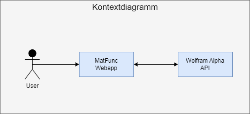
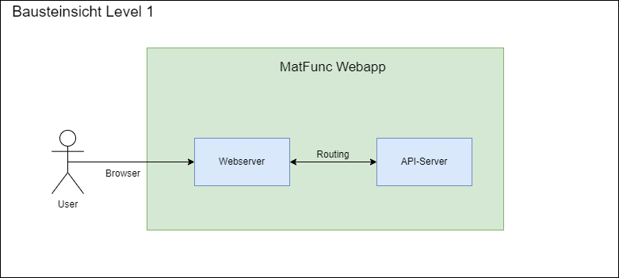
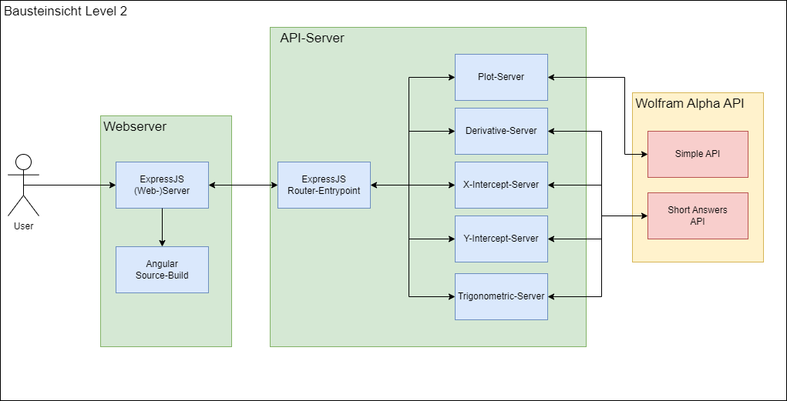
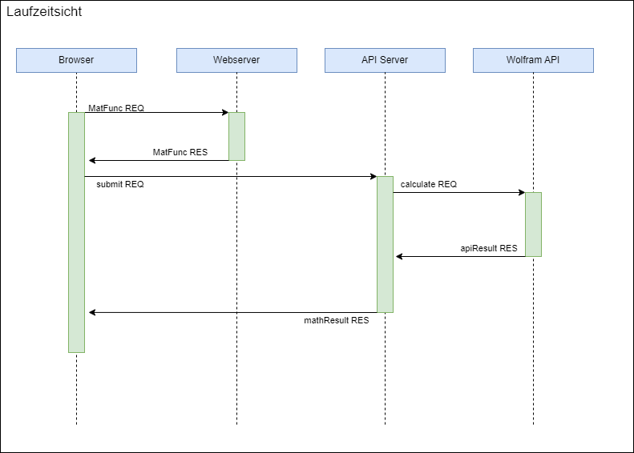
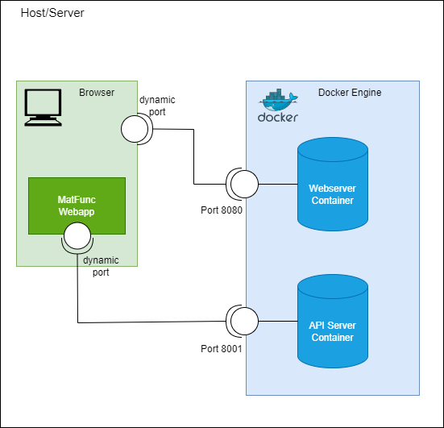

# MatFunc (Funktionsauswerter)

## Einführung & Kontext

Das in diesem Dokument erläuterte Softwareentwicklungsprojekt wurde im Rahmen des Moduls WEBLAB an der [Hochschule Luzern](https://www.hslu.ch/en/) durchgeführt. Hierbei wurde das Werkzeug MatFunc entwickelt, das eine bestimmte Anzahl von
Familien mathematischer Funkionen auswerten und Lösungen relevanter Informationen der entsprechenden Funktionen berechnen kann.

Das Werkzeug ist auf keine Zielgruppe beschränkt, sondern für alle Interessenten der Mathematik zugänglich.

## Ziele

Ziel des Softwareprojekts ist es, eine Eingabeoberfläche bereitzustellen, welche über einen beliebigen Web-Browser zugänglich ist und eine mathematische Funktion als Input erwartet. Die entsprechenden
fachlichen Anforderungen sind nachfolgend verkürzt aufgelistet (Aufzählungreihenfolge nach [MoSCoW-Priorisierung](https://de.wikipedia.org/wiki/MoSCoW-Priorisierung)). Die komplette Anforderungsliste ist unter /Aufgabenbeschreibung_Nikos-Joakimidis.pdf verfügbar.

**User Story 1: Mathematische Funkion eingeben (Prio 'Must')** 
Eingabe akzeptiert folgende mathematische Funktionstypen:
- Lineare Funktionen
- Exponentialfunktionen
- Trigonometrische Funktionen
- Polynome

**User Story 2: Berechnung von Informationen über eingegebene Funktion (Prio 'Must')** 
Folgende Informationen berechnet:
- Ableitung
- Nullstellen (Schnittpunkte auf X-Achse)
- Y-Achsenabschnitt
- Plot
- Periode (nur bei trigonometrischen Funktionen)
- Amplitude (nur bei trigonometrischen Funktionen)

**User Story 3: Anmelden Benutzer (Prio 'Could')**

**User Story 4: Registrieren Benutzer (Prio 'Could')**

**User Story 5: Historie der Benutzereingaben (Prio 'Could')** 
Voraussetzungen: User Story 3 & 4 implementiert

## Lösungsstrategie

Zur Implementierung des Softwareprojekts wurden Technologien eingesetzt, welche im WEBLAB-Unterricht eingeführt und behandelt wurden. Insbesondere zur Umsetzung des Front-End wurde das JavaScript Framework Angular gewählt, um dieses besser kennenzulernen und in zukünftigen Webentwicklungsprojekten einsetzen zu können.

Der angestrebte Technologie-Stack ist somit folgender:
- Angular (front-end)
- Node.js (back-end)
- PostgreSQL (falls User Stories 3, 4, 5)
- Wolfram Alpha API (externe API-Calls)

## Architektur

### Bausteinsicht Kontext

Aus Sicht der höchsten Abstraktion besteht die Web-Applikation aus der Entität "MatFunc Webapp", welche das gesamte System der Applikation zusammenfasst, sowie aus der Entität "Wolfram Alpha API", die das externe API der Plattform Wolfram Alpha zur Berechnung mathematischer Ausdrücke repräsentiert.

### Bausteinsicht Level 1 (Matfunc Webapp)

Bei einer tieferen Einsicht in das Gesamtsystem der Applikation MatFunc kristallisieren sich die beiden Entitäten Webserver und API-Server. 
Der Webserver dient schlicht der Übertragung von Dokumenten bzw. statischen Webseite-Artefakten. Der API-Server ist eine separate Entität, welche diverse Funktionalitäten über Webservices anbietet.

### Bausteinsicht Level 2 (Webserver & API Server)

In der tiefsten Bausteinsicht sind alle Prozesse der beiden Entitäten Webserver und API-Server ersichtlich. Nachfolgend sind die Prozesse und jeweils eine kurze Beschreibung aufgelistet:

**Webserver**
- ExpressJS (Web-)Server 
Webserver-Implementierung anhand JS Bibliothek express.js. Dient der Übertragung der statischen Web-Artefakten.

- Angular Source-Build 
Dies ist kein Prozess, sondern der Quellcode der über das Framework Angular erstellten Web-Artefakten.

**API-Server**
- ExpressJS Router-Entrypoint 
Entrypoint Prozess für API Anfragen der Webapplikation. Implementiert ExpressJS Routerfunktionalität zur Weiterleitung von Anfragen.

- Plot Server 
Prozess für die Generierung grafischer Darstellung mathematischer Funktionen (Koordinatensystem). Hierzu wird eine Anfrage an das Simple API von Wolfram Alpha geschickt.

- Derivative Server 
Prozess für die Berechnung der mathematischen Ableitung. Hierzu wird eine Anfrage an das Short Answers API von Wolfram Alpha geschickt.

- X-Intercept Server 
Prozess für die Berechnung der Nullstellen (Schnittpunkt des Funktionsgraphen mit der X-Achse). Hierzu wird eine Anfrage an das Short Answers API von Wolfram Alpha geschickt.

- Y-Intercept Server 
Prozess für die Berechnung der Achsenabschnitte (Schnittpunkt des Funktionsgraphen mit der Y-Achse). Hierzu wird eine Anfrage an das Short Answers API von Wolfram Alpha geschickt.

- Trigonometric Server 
Prozess für die Berechnung trigonometrischer Informationen. Hier wird die Amplitude (halbe Distanz zwischen Maximum und Minimum der Funktion) und die Periode (Abstände zwischen Auftreten der gleichen Funktionswerten) berechnet. Hierzu wird die gelieferte mathematische Funktion ausgewertet um identifizieren zu können, ob es sich um eine trigonometrische Funktion handelt. Anschliessend werden die Komponente der Funktion ausgefiltert, die für die Berechnung der Amplitude bzw. der Periode relevant sind (Beispielmuster: A sin(Bx)).

**Wolfram Alpha API**
- Simple API 
Webservice (REST-Resource für GET-Anfragen) der Plattform Wolfram Alpha, der zu einer beliebigen Query die entsprechenden Antworten in Form einer Bilddatei liefert.

- Short Answers API 
Webservice (REST-Resource für GET-Anfragen) der Plattform Wolfram Alpha, der zu einer beliebigen Query eine Kurzantwort in einfachem Text liefert.

### Laufzeitsicht

Im obigen Diagramm sind die Ereignisse dargestellt, welche zur Laufzeit über die Applikation bzw dem Gesamtsystem ausgelöst werden. Anbei jeweils eine Kurzbeschreibung (Titel repräsentieren keine Methoden/Funktionen im Quellcode):

- MatFunc REQ
GET Request Ereignis, welches ein Benutzer über einen beliebigen Browser auslöst um auf die Webapplikation zuzugreifen.

- MatFunc RES
GET Response Ereignis, welches die Übertragung von statischen Applikationsartefakte als Antwort auf GET Requests von Browsern auslöst.

- submit() REQ
Falls in der Webapplikation ein (Form-)Submit-Ereignis ausgelöst wird, schickt diese sechs HTTP GET Requests an den API-Server um die mathematischen Komponenten berechnen zu lassen.

- mathResult() RES
Sobald der API-Server die Berechnung jeweils abgeschlossen hat, wird das Resultat in der entsprechenden HTTP GET Response (body) an die Webapplikation zurückgesendet.

- calculate() REQ
Bei Erhalt von Berechnungsanfragen aus der Webapplikation, schickt der API-Server eine HTTP GET Anfrage an das Wolfram Alpha API zur Berechnung der entsprechenden mathematischen Ausdrücken.

- apiResult() RES
Wolfram Alpha wertet die gelieferten mathematischen Ausdrücke aus und sendet das berechnete Resultat in der HTTP GET Response (body) zurück.

### Verteilungssicht

Das Deployment erfolgt mittels Docker. Hierzu wurden für die beiden Server-Prozesse Webserver und API-Server jeweils separate Docker Images (siehe Dockerfile) und Container (siehe docker-compose.yml) eingerichtet. 
Der Quellcode wird direkt in das entsprechende Image (node.js official) kopiert und anschliessend werden per Kommando `npm install` die Node-Dependencies installiert. 
Für die Intialisierung der Container sind somit nur minimale Angaben nötige. Unter anderem die Freigabe der Netzwerkports, 8080 für den Zugriff auf den Webserver und 8001 für die API-Calls. Die Container werden in das [Bridge-Network](https://docs.docker.com/network/drivers/bridge/) gesetzt sodass die beiden Ports und die IP-Adresse des Host-Systems ein Socket bilden.

Auf der obigen Grafik wird das Deployment sowie die Zugriff auf die Webapplikation über dasselbe Host-System dargestellt (Host & Server identisch). Der Zugriff kann jedoch auch über das Netzwerk von einem Remote-Host ohne weitere Konfigurationen stattfinden.

## Fazit & Reflexion

Mit dem Abschluss der Entwicklung der Applikation bin ich froh und damit zufrieden, dass ich die Grundanforderungen im gegebenen Zeitrahmen umsetzen konnte und die Applikation auch funktionstüchtig ist. 
Gut finde ich, dass ich die Funktionen auf dem API-Server in verschiedene Serverprozesse unterteilt habe, was zur Folge hat, dass das System und somit auch der Code übersichtlicher gestaltet wird. 
Die gewählte Deployment-Strategie mittels Docker ist sehr flexibel und kann systemunabhängig eingesetzt werden. Auch hat mir dies die Chance ermöglicht, mich mit dieser Technologie ausseinanderzusetzen und mein Wissen zu vertiefen.

Leider konnten die angestrebten optionale Anforderungen nicht umgesetzt werden. Obwohl ich den vorgegebene Zeitaufwand von ca 60h fast erreicht habe, hat es doch nicht ausgereicht um ein Usermanagement (Registrierung/Anmeldung) und die Eingabehistorie (abhängig von Usermanagement) zu implementieren. Ursache liegt hierfür grösstenteils darin, dass ich den Aufwand für die Umsetzung der Grundfunktionalität sehr unterschätzt habe. Mir ist bewusst, dass dies ein zentraler Bestandteil beim Coding ist, jedoch war es während fast jeder Coding Session nötig diverse Informationen (JavaScript/Node/Angular) nachzuschlagen. Hier war das Unterrichtsmaterial sehr hilfreich.

Desweiteren ist der Design-Aspect eine, meiner Schwächen. Der Webauftritt der Applikation ist keine Besonderheit. Die CSS-Library Boostrap 5 war hierfür sehr hilfreich, um das Layout und Design bestimmter HTML-Elementen zu gestalten.

Ebenso fehlt noch eine umfangreiche Input-Validierung, um überhaupt auswerten zu können, ob es sich bei Benutzereingaben um mathematischen Funktionen handelt. Beispielsweise bei Eingabe des Stichwortes 'Zurich' wird schlicht eine Karte der Stadt Zürich als Bild angezeigt. Leider ist mir dies erst beim letzten Funktionstest aufgefallen, sodass keine Zeit mehr übrig war um es anzugehen (keine Unit-Tests definiert). Automatisierte Unit/Funkions-Tests muss ich in Zukunft laufend und parallel zur bzw vor der Entwicklung definieren.

Zukünftig muss unbedingt der Zeitaufwand zur Umsetzung der Anforderungen besser eingeschätzt werden, z.B. mittels Zerlegung in kleinen und detailierten Arbeitsschritten. Somit kann es auch klar werden, ob die Zeiteinschätzung und/oder die Umsetzung bestimmter Anforderungen realistisch ist.

